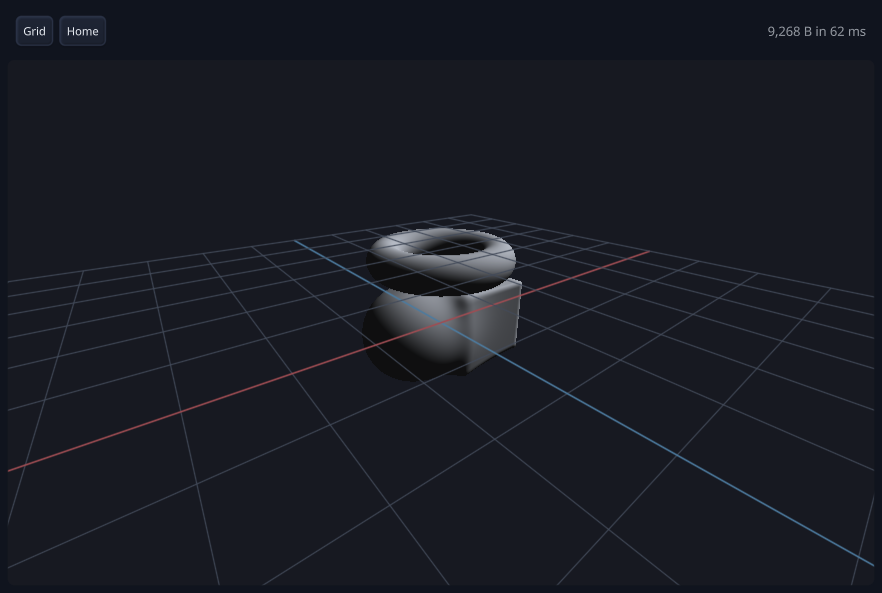

# Driving the designer

Status: **works end to end**, and the picture in this document was taken by following it.

Two instruments are wired into this application, both off unless asked for:

- **`vexelray-gui-automation`** — an out-of-process agent driving the real application: real window, real Vulkan,
  real frame loop, input injected through the ordinary Tactroller path so there is no automation branch to drift
  out of sync. See [`vexelray-gui/docs/automation.md`](../../vexelray-gui/docs/automation.md).
- **`atchung-probe`** — the profiling seam the whole stack reports through: spans with percentiles, counters, and
  a resource ledger that is the leak half. See [`atchung/docs/probe.md`](../../atchung/docs/probe.md).

The viewport is the reason both matter here. It cannot be checked by reading a number — "is it right" is a
question about pixels — and it is the one window `--capture` structurally cannot photograph.

---

## 1. Switching them on

```bash
mvn -o compile exec:exec "-Dautomation=on"                      # two drivers
mvn -o compile exec:exec -Pprofiler                             # everything the probe has
mvn -o compile exec:exec "-Dprobe=gpu,shader" "-Dprobe.out=run.log"
```

Two drivers come up, and the second is the one that matters:

```
automation: tree listening on 127.0.0.1:7654       the toolbar, the tree, the properties panel
automation: viewport listening on 127.0.0.1:7655   the marched picture and its status
```

The viewport is on **the port above** whatever `-Dautomation` names, so `-Dautomation=9000` puts the tree on
9000 and the viewport on 9001. Each is bound to its own `Gui` tree, so `tree` on 7654 does not list the viewport
and `shot` on 7654 photographs the wrong window. Loopback only, one connection at a time each — a pointer is
one hand.

The run is **uncapped**, which is what you want: the loop parks between frames and the drivers keep working.
Passing `--capture` makes it a three-frame script that will have exited before your first command lands. Kill
the uncapped run when you are done.

### Talking to it

One command per line in, one reply out terminated by a line containing only `.`, every reply beginning `ok` or
`err`. Replies are **CRLF-terminated** — a client looking for a line equal to `.` will hang on the first reply
unless it strips the `\r`.

```bash
#!/bin/bash
# drive.sh PORT  -- commands on stdin, replies on stdout
port=$1
exec 3<>/dev/tcp/127.0.0.1/$port || exit 1
while IFS= read -r cmd; do
  printf '%s\n' "$cmd" >&3
  while IFS= read -r line <&3; do
    line=${line%$'\r'}
    [ "$line" = "." ] && break
    printf '%s\n' "$line"
  done
done
printf 'quit\n' >&3
```

## 2. The landmarks

Landmarks, not refs. A ref is a node id minted per run, so a script that clicks ref 12 cannot be replayed
tomorrow; a landmark can also be *navigated* to, so a concealed target is revealed rather than refused. They
are declared as constants in `DesignerApp` precisely so that renaming one is visibly a breaking change.

| Landmark | Window | What it is |
|---|---|---|
| `toolbar` | 7654 | the three rows of add buttons |
| `tree` | 7654 | the object/modifier tree's scroller |
| `properties` | 7654 | the selected item's sliders |
| `status` | 7654 | the selected item's name and numbers |
| `view` | 7655 | the canvas the picture is marched into — **drag targets go here** |
| `view.status` | 7655 | shader size and compose time |
| `view.state` | 7655 | the machine-readable state of the view. Hidden; see below |

`view` had to be named. It is a bare box with no role and no text, so it appeared in no `tree` listing and
matched no `find` — the subject of the whole window was the one node in it nothing could address.

**The toolbar buttons are not landmarks**, deliberately: there are twelve and they are named by their own text,
so `find Sphere` finds one. Note that `click` takes a ref, a landmark or `x,y` — **not** a text match, so it is
`find Sphere` and then `click <ref>`, not `click Sphere`.

## 3. Waiting for the picture: `view.state`

`view.state` is an invisible, zero-height text node whose **name is the state of the view**. It is in the tree
on purpose — the semantic snapshot describes hidden subtrees rather than skipping them, so its name is
published and legible while nothing about the window changes.

It has to exist because **`settle` cannot see either half of getting a picture here.** A scene change is
lowered and composed on a worker; the march runs from the frame loop because `renderInto` submits to a
`VkQueue`. Neither is a mutation the loop is owed, so nothing reports it owed, and `settle` is exact about the
frame loop and blind to work in flight.

It reads `view <n> <phase>`:

| Phase | Means |
|---|---|
| `view 3 requested` | the design has been handed over; nothing lowered yet |
| `view 3 composed 9340` | lowered to SPIR-V, that many bytes; the march is owed |
| `view 3 refused` | the surface would not compile. `view.status` says why — usually the node ceiling (R2) |
| `view 3 marched 866x525` | it is on the glass, at that size |

**The number is the whole point.** Waiting for `marched` alone is satisfied the instant you ask, because what
this node said before your request is that the *previous* scene marched — so a photograph taken then is of the
old design under the new heading, reported as a success. Read the revision, act, wait for the next one.

`marched` is published **after** `renderInto` returns, not before. `renderInto` waits for its own submission,
so by then the image really is in `SHADER_READ_ONLY` and the next presented frame samples it.

## 4. The whole sequence

```
7654> find Sphere
ok 3
14 - "Sphere" [15,42 68x15]
12 - "Sphere" [8,8 83x56]

7655> find view.state
ok 1
4 - "view 1 marched 866x525" @view.state [0,0 0x0] hidden

7654> click 12
ok 49,36

7655> await view.state view 2 marched
ok view 2 marched 866x525
7655> find view.status
ok 1
2 - "9,340 B in 3 ms" @view.status [775,16 91x30]
7655> shot after.png
ok C:\...\vexelray-designer\after.png 99911 bytes
```

Then **open the PNG**. That is the point of the exercise: `9,340 B` is consistent with an added sphere and
consistent with a great many things that are not one.



A caution the first run of this earned: adding a primitive with nothing selected puts it at the origin at its
default size, where the seed design's own blend encloses it — so the shader grows, the revision advances, and
the picture is **identical**. That is correct behaviour and it looks exactly like a dropped click. Select a
parent first, or move it, before concluding anything from the pixels.

### Turning it

`view` is drag-locked — the gesture is a displacement, not a position, so the pointer is held for its duration.
Address it by coordinate, because a turn is about where in the box you started:

```
7655> drag 400,300 560,300
7655> await view.state view 2 marched 866x525
```

A turn is a camera change, so it does **not** advance the revision: it is six floats of push constant and
recompiles nothing. Wait on the phase, not on a new number.

## 5. What the probe found

Worth recording, because it is the argument for having it wired in at all. Its first run on this application
reported:

```
resource                                     opened     closed       LIVE
GraphicsPipeline                                  3          2          1
```

`Viewport.ensurePipeline` closes the pipeline it *replaces*, and nothing closed the last one at shutdown. One
leaked pipeline per run, invisible to every other signal. `Viewport.close()` is the fix and the ledger now
reads `3 / 3 / 0`.

The two lanes that matter for this application are **`shader`** (lowering and SPIR-V generation) and **`gpu`**
(fence wait, submit, present, and native resource lifetimes), because a scene change is a lowering plus a
pipeline build — the exact cost R1 and R4 exist to remove, and therefore the thing to measure rather than argue
about. A representative three-frame run:

```
shader lower to spirv          2    43.68ms   21.84ms   12.58ms   29.36ms   43.68ms
gpu    present frame           6    68.48ms   11.41ms    1.57ms   50.33ms   52.34ms
```

## 6. What the drivers found

Also worth recording. Driving one click through the tree window took `view.state` from `view 1` straight to
`view 3` — two lowerings and two pipeline builds for one added sphere. `Design.add` announced the change, and
so did the `Change` it performed, from inside its own `apply`. Every structural edit was doing double work, and
nothing visible said so: the picture was right, the status line was right, and only the revision counter
disagreed.

That is the case for an instrument over an inference, and it is why the counter is in the node's name rather
than left implicit.
