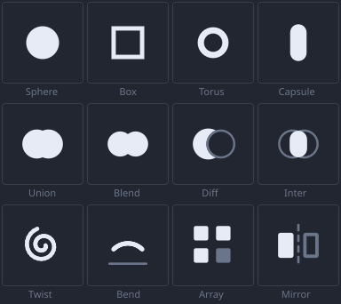

# Icons: what the atlas cannot say, and what a drawing can

> **Note from a mistake.** The first toolbar was twelve Unicode marks and every one of them drew as a box. This
> records why, so it is not rediscovered — and then what replaced them. The toolbar now carries drawn icons over
> their names; §6 is the built set.

---

## 1. The charset in the pom is a request, not a manifest

`vexelray-text/pom.xml` asks the atlas generator for a generous set of ranges:

```
[0x2190, 0x21FF]   arrows
[0x2200, 0x22FF]   math operators
[0x2500, 0x257F]   box drawing
[0x25A0, 0x25FF]   geometric shapes
[0x2700, 0x27BF]   dingbats
```

Reading that list, `∪` `∩` `∖` for the booleans and `●` `■` `◆` for the primitives look like a free icon set with
real semantics and no sheet to ship. They are not there.

`msdf-atlas-gen` can only rasterise the **intersection of what is asked for and what the font has**, and it
skips the rest silently. `NotoSans-Regular.ttf` covers Latin, Greek, Cyrillic, punctuation, currency and the
letterlike block. Geometric shapes, arrows, dingbats and the math operators live in *Noto Sans Symbols* and
*Symbols 2*, which the atlas does not include.

## 2. What the built atlas actually holds above U+2000

Read off `vexelray-text/src/main/resources/dev/vexelray/text/atlas/primary.json` — 922 distinct codepoints in
total, and above `U+2000` exactly:

| Range | Contents |
|---|---|
| `U+2000–U+206F` | General Punctuation — dashes, quotes, bullet `•`, dagger, ellipsis, primes, `⁘` `⁙` `⁚` `⁛` `⁂` `※` |
| `U+20A0–U+20BF` | currency |
| `U+2100–U+214F` | Letterlike — `℮` `ℓ` `№` `™` `Ω` `℧` `ℵ` `⅁` `⅂` `⅃` `⅄` |
| `U+2212` | the minus sign, and it is **the only math operator** |
| `U+25CC` | dotted circle |
| `U+FFFD` | the replacement character |

`calculator-vexel-demo`'s README says this outright: *"of the mathematical operators exactly one, the minus
sign ... a missing glyph renders as a box."* It also shows the working strategy — its two tab icons are `⁘`
(U+2058, General Punctuation) and `θ` (Greek), both present. The constraint was written down before this
prototype was built, and the pom's charset was believed over it.

## 3. The immediate fix: words, checked by a guard

The toolbar is named buttons, four to a row. For a vocabulary nobody around here has used before, a word is
also plainly better than a mark — "Blend" carries more than any glyph would.

Reasoning about Unicode blocks is what caused the bug, so the atlas is now the only authority:
[`tools/bench/GlyphCheck.java`](../tools/bench/GlyphCheck.java) loads the built atlas and asserts that every
character the application displays resolves to a real glyph. Run it after touching any user-visible string.

```bash
# from vexelray-designer, with target/classes and the runtime classpath
java -cp ".;target/classes;$(cat cp.txt)" dev.vexelray.designer.GlyphCheck
```

It is checked against itself: feeding it the original twelve marks fails with all ten distinct codepoints named
and a non-zero exit.

## 4. The real upgrade: draw them — since done, see §6

Glyphs are not the only way to get an icon, and for this application they are not the best one. `Picture` from
`vexelray-gui-draw` offers `fill` (a rounded box, so also a rectangle and a circle), `outline`, `line` at any
angle, and `glyphs` — and `Node.picture()` puts one on any box, drawn over the image and under the border.

That is enough for every icon here, and better than a font for most of them:

| Icon | Drawn as |
|---|---|
| Sphere | a filled circle |
| Box | a square outline |
| Torus | two concentric rings |
| Capsule | a tall rounded fill |
| Union / Diff / Inter | two overlapping circles, filled to say which region survives |
| Twist | a polyline spiral — a polyline is one `line` per segment, so any curve is expressible |
| Bend | a polyline arc |
| Array | three small squares |
| Mirror | a square and its outline across a dashed axis |

They cost no atlas, no font, and no sheet; they scale with the UI because a picture is rebuilt for the box that
was measured; and the same `Picture` exports to SVG, so the toolbar and any documentation of it can share one
source. The boolean triad is the strongest argument: *which region survives* is the actual semantics, and two
overlapping circles say it in a way `∖` does not.

This was written as the next step and is now built (§6). The prerequisite was nothing. Words shipped first only because they got
the tool working in one pass, and a drawn icon set is a design job rather than a bug fix. The names stayed, under
the icons: for a vocabulary this unfamiliar, the pair reads better than either alone.

## 5. If a glyph is ever wanted instead

Adding a symbols face to the atlas is the other route, and it is the same mechanism
[`vexelray/docs/math-face.md`](../../vexelray/docs/math-face.md) describes for STIX Two Math: one more
`<extraFont>` in the `primary` atlas with its own charset. `AtlasData.face(int)` already returns "that face's
metrics and glyphs over the same image", and the atlas already carries a second face this way.

Worth knowing that it is cheap, and worth not reaching for it here: a symbols font would add a dependency and
an atlas rebuild to get marks that are less clear than the words they would replace.

---

## 6. What was built

The drawn set is [`Icons.java`](../src/main/java/dev/vexelray/designer/Icons.java), authored in the unit square
and scaled to whatever box it lands in, rebuilt from `onResizeUi` so it follows the UI zoom — a picture is in
pixels, and redrawing for the box that was measured is the only way it can track a zoom.



The sheet above is generated by [`tools/bench/IconSheet.java`](../tools/bench/IconSheet.java) from the *same*
`Picture` values the toolbar draws, through `SvgSink` instead of the canvas. That is the point of a picture
being authored once and consumed twice: this is the icon set, not a mock-up of it.

**One honest approximation.** Union and Difference are exact — a union is what painting two discs leaves, and a
difference is the second disc painted in the surface colour, which is a hole rather than a picture of one. An
Intersection is not: its lens is bounded by two arcs, and with no filled polygon and no clip there is nothing
that fills between them. It is drawn as a stadium spanning the true lens inside two faint outlines, which at
24px reads correctly and at 96px is visibly a stadium. The exact version needs the filled polygon that
`drawing.md` §7 lists as still ahead, and that prerequisite lands in `vexelray`, not here.
